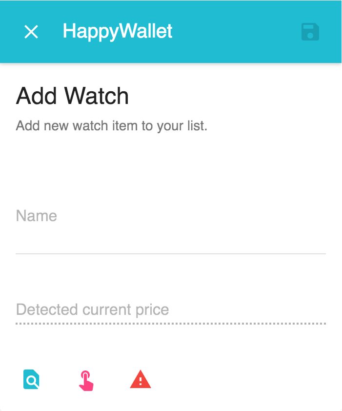
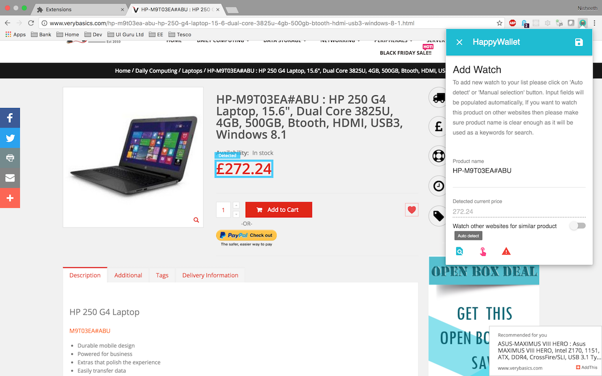
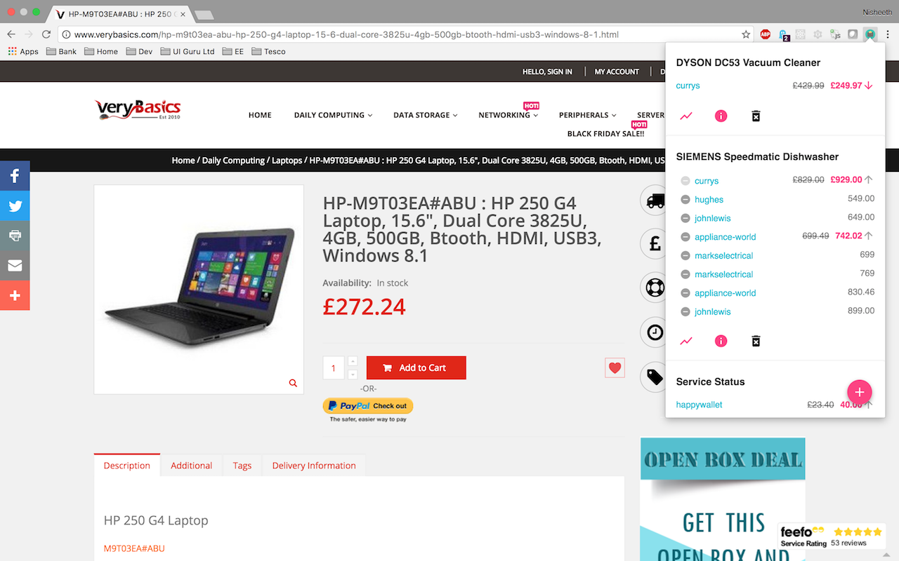
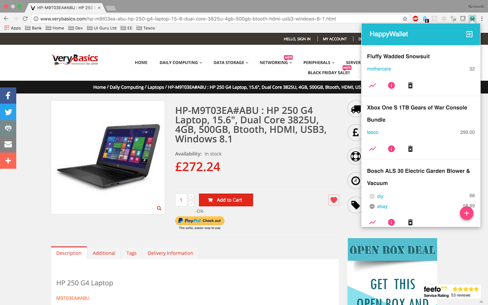
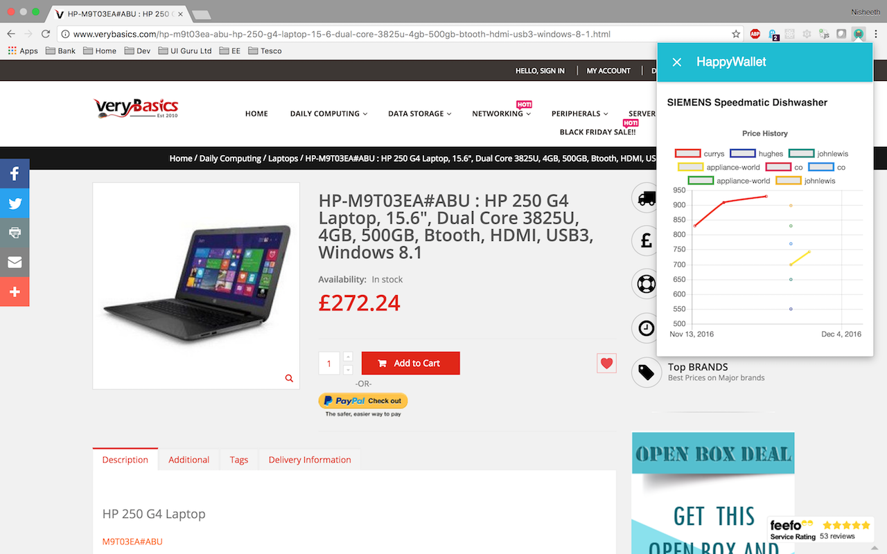

`Flyby` is codename for chrome-extension

## TODO List

- Update all dependencies
- Update webpack scripts
- Dependencies cleanup (use create-react-app & remove unnecessary dependencies) 
- Use new version material-ui, react, redux, etc
- Remove mocha tests and add jest unit tests
- Verify and update OAuth flow still works
- Push notification support through AWS SNS/GCP (outside the scope of refactoring)

## Demo

## Screens

